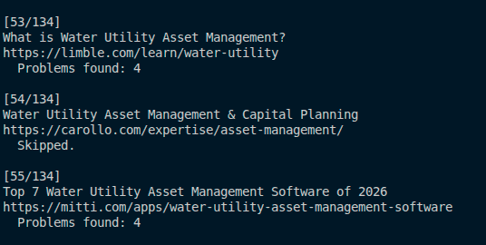
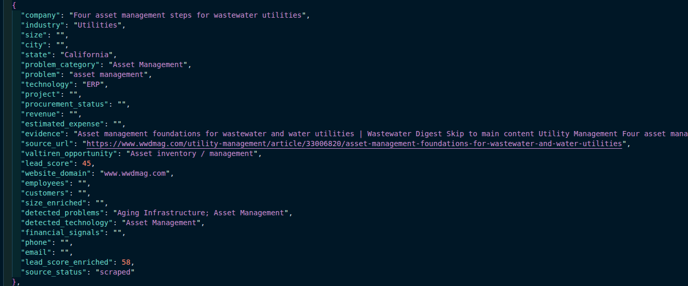
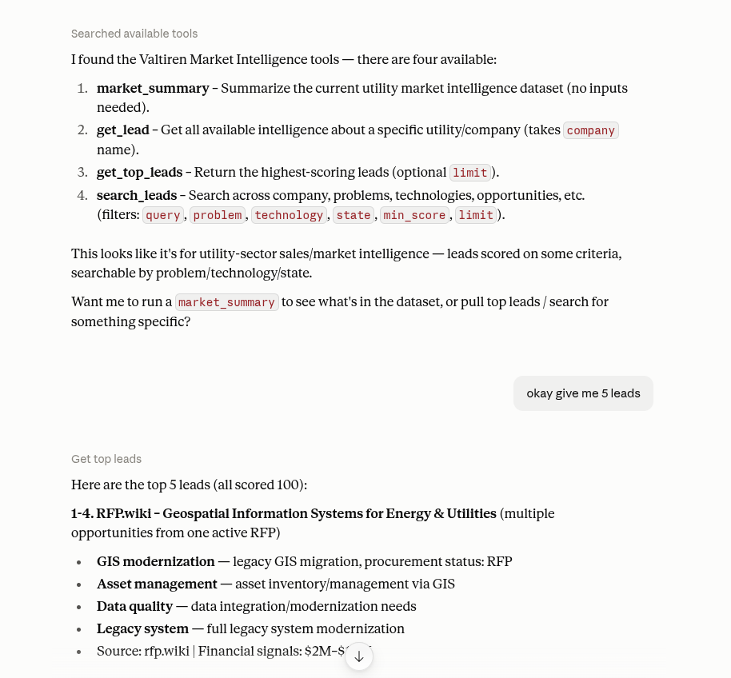

# Valtiren Intellegence Market Finder

This is used for data analysis to find and scrape problems and bottlenecks for problem in US Market Utilities. Valtiren needs to be accurate and factual to gain trust with US market utilities thats why scrapping real data is the key to find common problem patterns then outreaching them.

This then stored in csv/json the result scrapped then prepare enrichment for AI to improve readability and analysis of the overall trend. MCP and claude AI are to report me a detail summary of this for all the details that we needed to get traction to US Utility Clients.

## Screenshot

## Architecture

visit this [link](docs/architecture.md)

## Installation

visit this [link](docs/installation.md)
